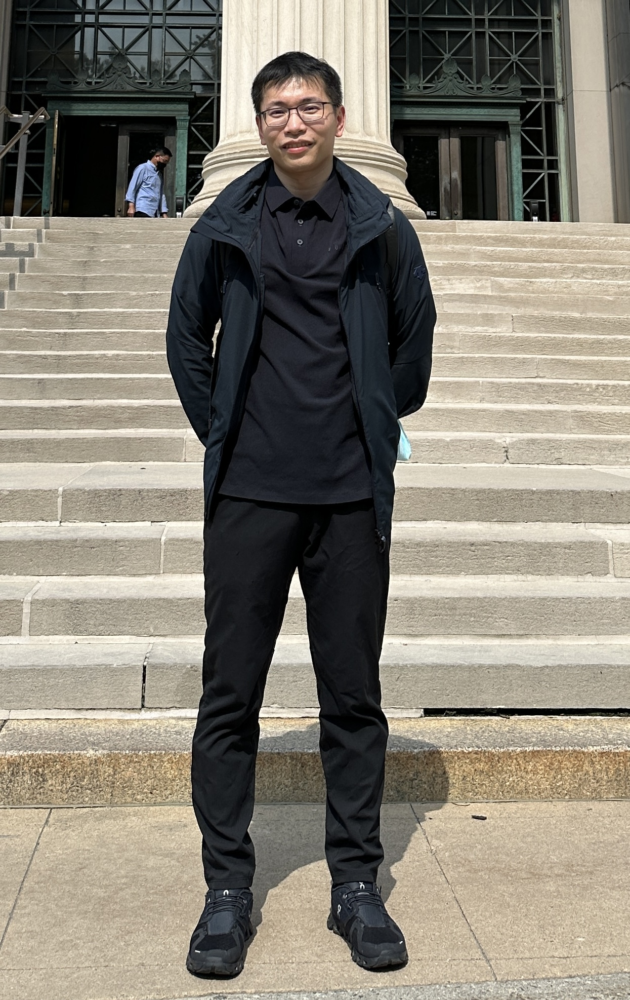

### About Me

I am a Senior Researcher at Microsoft Research Asia-Vancouver. My research began in hardware, with a focus on near-storage accelerators, and has evolved through databases, vector search systems, and AI infrastructure disaggregation. I am now focused on AI chip and infrastructure design, taking a top-down, workload-driven approach that spans AI models, system software, and hardware architecture. I am particularly interested in leveraging Artificial Specialized Intelligence to co-design scalable, efficient platforms for modern AI.

I received my Ph.D. (2021) and S.M. (2016) in Electrical Engineering and Computer Science from MIT, and my B.S. (2012) in Electrical and Computer Engineering from the University of Illinois at Urbana-Champaign.

📍 Vancouver, BC  
🔗 [Google Scholar](https://scholar.google.com/citations?user=Pbgme5oAAAAJ&hl=en)

---

### Research Areas

- AI-driven AI Infrastructure Design  
- Hardware Disaggregation Systems for AI Workloads  
- Vector Databases  

---

### Recent Publications

- **[RAPIDSCRIBE @ ICDCS'25]**: LLM training snapshots
- **[NeoMem @ MICRO'24]**: CXL-native memory tiering  
- **[VBase @ OSDI'23]**: ANNS + SQL  
- **[SPFresh @ SOSP'23]**: Real-time vector index update  

[→ Full Publication List](publications.md)

---

### Service

- Organizer, **The Seventh Young Architect Workshop** @ ASPLOS 2025 [Link](https://yarch2025.stanford.edu/)
